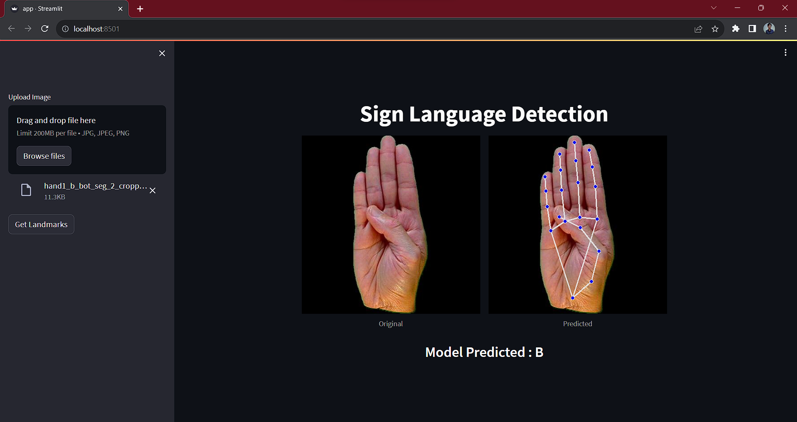

# Results

Using the landmarks coordinates for hand gestures {x,y,z} generated using mediapipe i transformed the dataset to a graph classification problem. 
Our model also achieved quite a good accuracy - 90% on training set and 86% on test set.

